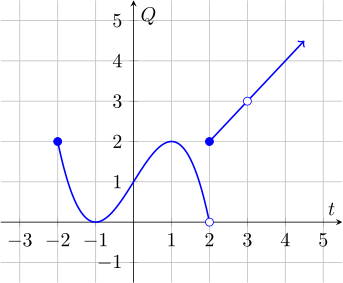
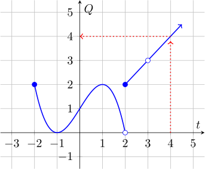

Think of a function as a machine which takes an input and, depending on that
input gives one output.

We usually give a function a name like $f$

For example, you could have a function $f$ that can accept the name of any
month as an input, and outputs the corresponding number of that month:

$$\begin{aligned}
f(January) &= 1\\\\
\vdots&\\\\
f(December) &= 12\\\\
\end{aligned}$$

For any function, we use the notation $f(x)$ to mean "The value of $f$ when we put in $x$ as an input." In particular, do not mistake this
notation for multiplication: $f(x)$ does not mean "$f$ times $x$", because $f$
is a function.

We could also write inputs and outputs of $f$ in **ordered pairs**, for
example: $(\text{April}, 4)$ and $(\text{May}, 5)$.

In our example, we can't use the word `elephant` as an input, because
`elephant` isn't a month. We say that `elephant` is not in the **domain** of
$f$.  In our example, the domain of $f$ is all the names of the months.

The collection of values that are possible outputs of $f$ is called the
**image** of $f$. In our example, the image of $f$ includes exactly the numbers
1-12. The number $32$ isn't in the image of $f$ because there's no month (input
to $f$ ) whose number (output of $f$) is $32$.

### Definitions:

#### Function

---

A **function** is a rule for associating a set of inputs to a set of outputs.
For each input $t$ there should be exactly one associated output $f(t) = Q$. An
input and its associated output can be expressed as a pair in parentheses, $(t,
Q)$.

---

**Examples**

* A function $g$, which takes as input a person, and outputs their hair color
* A function which takes as input a city name and outputs the average
    temperature in that city
* A function defined by the following ordered pairs: $(1,2),\ (2,4),\ (4, 4)$.

**Non-Examples**

* A relation that takes as input a date and outputs people born on that date.
    This is not a function because there may be more than one output for an
    input.
* A relation defined by the following ordered pairs: $(1,2),\ (5, 7),\ (1, 4)$,
    because the input  $1$ is associated to both the output $2$ and the output
    $4$.

#### Domain

---

The **domain**, or **mathematical domain** of a function $f$ is the set of
possible inputs.

The **practical domain** of a function $f$ is the set of inputs that make sense
in the context of some real-world interpretation of the function $f$.

---

#### Image

---

The **image** of a function $f$ is the set of all possible outputs of $f$.

---

### Functions Defined by Formula

We can use formulas to define functions which take numbers as input (Which is
the kind of function we'll be talking about in this course).

##### Evaluating Functions Defined by Formula:

When you evaluate a function defined by a formula,
**wherever you see the dependent variable (usually $t$ or $x$) in the
formula, you replace it with the input**. Remember, whatever is in the parentheses to the right of the function
name is the input.

Here are some examples:

* The function that doubles its input, $f(t) = 2t$, for which:
    * $f(0) = 2(0) = 0$
    * $f(3) = 6$
    * $f(-3) = -6$
    * $f(x^2 + 2)$, where the input is the expression $x^2 + 2$, we can
        evaluate by putting $(x^2+2)$ (the parentheses are important) wherever
        we see $t$ in the formula for $f$. So $f(x^2 + 2) = 2(x^2 + 2)$.
* The function that squares its input, $g(x) = x^2$ for which:
    * $g(0) = (0)^2=0$
    * $g(2) = (2)^2 = 4$ 
    * $g(-3) = 9$
    * $g(t-3t^2) = (t-3t^2)^2$
* The function that takes the square root of its
    input, $r(b) = \sqrt{b}$, for which
    * $r(0) = 0$ 
    * $r(4) = 2$
* The function that outputs the reciprocal of the input, $q(t) = \frac{1}{t}$
    for which
    * $q(1) = 1$
    *  $q(2) = \frac{1}{2}$
* The function that adds three, then divides by two and takes the square root
    $s(t) = \sqrt{\frac{t + 3}{2}}$, for which
    * $s(8) = 2$

The (mathematical) domain of the functions $f$ and $g$ is all real numbers, or
in interval notation, $(-\infty, \infty)$.

The domain of  $r$ is the set of possible inputs to the square root. Since we
can take square roots of positive numbers and $0$, but not negative numbers,
the domain is $[0,\infty)$.

The domain of $q$ is the set of inputs for which the formula is defined. In
this case, the only input for which the formula doesn't specify an output is $0$, because  $\frac{1}{0}$ is undefined. We can divide $1$ by any other number, so the domain is all numbers except zero, or $(-\infty, 0)\cup (0, \infty)$.

The domain of $s$ is the set of numbers that we can put in for $t$ so that
$\frac{t+3}{2}$ is nonnegative (that is, in the domain of the square root).
This happens when $t$ is greater than or equal to  $-3$, so the domain is $[-3,
\infty)$.

---

**Example problems:**

The height in inches of the average child, $t$ years after birth is given by the formula
$f(t) = 3t + 18$. How many years does this model predict it will take for the
average child to grow to $32$ inches? What is the mathematical domain of $f$?
What is the practical domain of $f$?

### Piecewise Defined Functions

Sometimes functions behave differently on different parts of their domain. When
we want to describe these functions with a formula, it sometimes helps to use
piecewise notation.

For example, suppose you drop a feather from a height of six feet. The feather
falls at approximately a constant rate, until it hits the ground three seconds
after you drop it. It then doesn't move. We could express the height of the
feather in feet, after $t$ seconds with the
following notation:

$$ f(t) = \begin{cases}
6-2t,& t \leq 3\\
0,& t > 3 \\
\end{cases}
$$

##### Example Problem:

Given a function like
$$ f(t) = \begin{cases}t+1,& t\leq -1\\
t^2,& t > -1\end{cases} $$
We could be asked something like:

> For what values of $t$ is $f(t) = 4$?

To answer this, we should do the following:

* First, solve $4=t+ 1$ for  $t$, giving $t=3$. However, $f(t)$ is only defined
    as $t+1$ when $t\leq -1$, and since $3$ is not less than or equal to $-1$,
    this is not a solution.
* Second, solve $4 = t^2$. This equation is true when $t=2$ and when $t=-2$.
    However, $f(t)$ is only defined as $t^2$ when $t > -1$, which is only true
    for $t=2$. Therefore, $t=2$ is the only value of $t$ for which $f(t) =4$.

### Functions Defined by Table

We can express a function as a table:

 $t$ | $f(t)$
---|---
1 | 3
2 | 4
3 | 2
4 | 9
5 | 7
6 | 8

Here the function can only accept inputs in the first column, and for each
input, the corresponding output is read immediately to the right.
The domain of the function $f$ described above is the whole numbers from  $1$
to $6$.

Just as a few examples, we can see from the table that $f(1) = 3$, $f(4) = 9$,
and $f(6) = 8$.

##### Example Problem:

We could be asked something like:

> "Add an entry to the table so that $f$ is no longer a function."

To solve this, recall that a function must have one output for every input, so
to make $f$ no longer a function, we could add an entry to the table which has
the same $t$ value as an entry already in the table, with a different
corresponding output. For example, adding the point $(6, 7)$ to the table would
make $f$ not a function.

### Functions Defined by Graph

We can express a function $Q = f(t)$ using a graph:

Here the input variable, $t$, is represented along the horizontal axis, and the
output variable, $Q$, is represented along the vertical axis. To read the value
of the function given an input, we locate the value of $t$ on the horizontal
axis, move upward to the graph of the function, then read the output of the
function, $f(t)$ as the height of the graph at that point, on the vertical
axis.

For example, to compute $f(4)$, we trace upward from $4$ on the horizontal
axis, and see that the height of the graph at that point is $4$ on the vertical
axis, so $f(4) = 4$. This process is shown in red below:

Similarly, we can see that $f(4) = 4$, $f(0) = 1$, and $f(-1) = 0$.

Some things to know about graphs:

* What is the value of $f(2)$? Well, the 'open' dot at the point $(2,0)$ means
    that the curved line does **not** extend all the way to $t=2$, so the
    height of the graph at $t=2$ is given by the solid dot above. That is,
    $f(2) = 2$.
* Similarly, the open dot at the point $(3,3)$ means that there is a break in
    the line at $t=3$. Since there is no solid dot above or below, the function
    is not defined at $t=3$.
* The arrow on the right side of the straight line means that although values
    are not shown on the graph, the function is defined for larger values of $t$ than shown on the graph.
* The solid dot on the left end of the curvy line means that the function is
    not defined for smaller values of $t$, but is defined at $t=-2$. If the dot
    were open, it would mean that the function is defined for values of $t$ 
    greater than $-2$, not including $-2$.
* Based on these facts, the domain of the function is all values of $t$ greater
    than or equal to $-2$, not including $t=3$. In interval notation, the
    domain is $[-2, 3)\cup (2, \infty)$.

### Functions Defined Verbally

Sometimes a relationship between variables is described using words, and you
may be expected to express that relationship using equations. To do this you
will often need to know the meaning of the following two phrases:

Given two quantities $t$ and $Q$, a sentence like

> "$Q$ is **proportional** to $t$"

means that $Q = kt$ for some constant $k$.

A sentence like

> "$Q$ is **inversely proportional** to $t$"

means that $Q = \frac{k}{t}$ for some constant $k$.

---

##### Example:
Suppose you are asked to express the following relationship as an equation:

> "The gas required to drive your car 100 miles is proportional to the square
> of the speed at which you drive. If you drive 60mph, it takes 4 gallons to
> drive 100 miles."

* First we should name our variables. Let's call the amount of gas it takes to
drive 100 miles $G$, and the speed at which we drive $s$.
* Then "the square of the speed at which you drive" means $s^2$, so the
    sentence "The gas required to drive your car 100 miles is proportional to
    the square of the speed..." means the same thing as "$G$ is proportional to
    $s^2$", which suggests the equation $G = ks^2$ for some constant  $k$.
* Finally, we can solve for $k$ using the fact that "If you drive 60mph, it
    takes 4 gallons to drive 100 miles". In other words, when $s = 60$, $G
    = 4$, so we have the equation $4 = k*60$. Solving for $k$ we find that $k
    = \frac{1}{15}$, so our final equation becomes $G = \frac{1}{15}s$.
