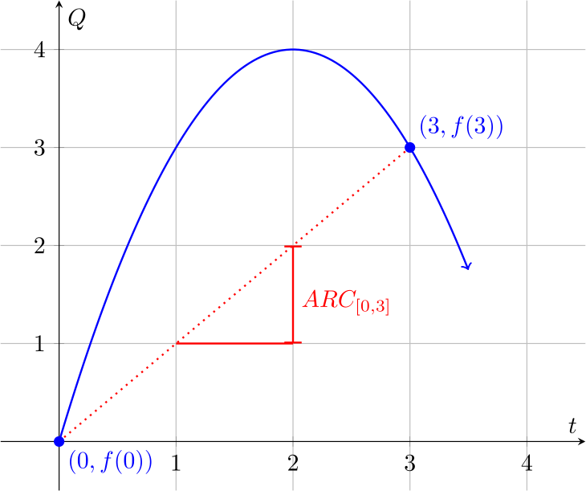
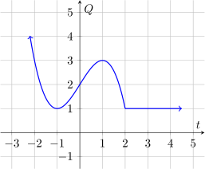

### Average Rate of Change

Given a function $f$ and an interval $[a,b]$, we can compute the average rate
of change of $f$ on the interval, which we call $\text{ARC}_{[a,b]}$. It can be
computed with the following formula:

$$\text{ARC}_{[a,b]} = \frac{f(b) - f(a)}{b - a}$$

This may not make sense, but it is useful. We can interpret the ARC as follows:

> **"For each unit increase in $t$, the input variable of $f$, between $t=a$ and
> $t=b$, the value of $f(t)$ increases by $\text{ARC}_{[a,b]}$ units on
> average."**

In other words, it is the average rate at which the value of the function
changes between $t=a$ and $t=b$.

Here's a picture to understand it better:

So in this example, we're computing the ARC of $f$, which is the blue line on
the graph, on the interval $[0,3]$. The total increase in $t$ between the two
points is $b-a = 3 - 0 = 3$, and the total increase in $f(t)$ between the two
points is $f(b) - f(a) = f(3) - f(0) = 3 - 0 = 3$, so on the interval $[0,3]$,
the average increase in $f(t)$ for every one unit increase in $t$ is 

$$\text{ARC}_{[0,3]} = \frac{3}{3} = 1$$

Notice that if we had chosen an interval other than $[0,3]$ to compute the
average rate of change on, we would have come up with a different answer,
because the red line between the two points would have been (likely) at
a different angle, or slope.

### Increasing and Decreasing

A function is said to be **strictly increasing** on an interval $(c, d)$ if for
every  $a$ and $b$ in the interval $(c,d)$, with $a \lt b$, $f(a) \lt f(b)$

A function is said to be **strictly decreasing** on an interval $(c, d)$ if for
every  $a$ and $b$ in the interval $(c,d)$, with $a \lt b$, $f(a) \gt f(b)$

A function is said to be **constant** on an interval $(c, d)$ if for
every  $a$ and $b$ in the interval $(c,d)$, with $a \lt b$, $f(a) = f(b)$

These may seem like confusing sentences, but this is very intuitive. For
example, consider the graph of the function $f$ below:

As we move from left to right along the graph, we see that the height of the
graph (which represents the value of $f$) decreases until we get to $t=-1$.
Then the height of the graph increases until we get to $t=1$. Then the height
of the graph decreases again until we get to $t=2$, and finally the height of
the graph stays constant for all $t > 2$. So, we can say that:

* $f$ is decreasing on $(-\infty, -1)\cup (1,2)$ 
* $f$ is increasing on $(-1, 1)$, and
* $f$ is constant on $(2, \infty)$.

### Linear Functions

Unlike the example above, **linear functions are functions that always have the
same average rate of change no matter what interval you choose.** In other
words, the graph of a linear function is always a straight line. The average
rate of change of a linear function is called its **slope**.

---

#### Definition:

A function  $f$ is a linear function if it can be written in the form
$$f(t) = at + b$$ 

The constant $a$ is the **slope** of the function, which is the same as the average
rate of change, and for any two points $(t_1, Q_1)$ and $(t_2, Q_2)$ of  $f$, 
$$ a = \frac{Q_2 - Q_1}{y_2-y_1}$$

The constant $b$ is the **vertical axis intercept**. That is, $f(0) = b$.

A collection of points is **collinear** if all the points lie on a single line,
or (equivalently) if all the points are on the graph of a single linear
function.

---

#### Example Problems:

1) _Find the equation for the linear function that contains the points $(1,2)$
and $(8, 16)$._
    1) **First method:**
        * Since the equation is linear, it will have the form $f(t) = at + b$.
        * First find the **slope**, $a$. Use the formula for the slope above, where
            $t_1 = 1,\ Q_1 = 2,\ t_2 = 8$, and  $Q_2 = 16$. You should get that $a
            = 2$.
        * Now we must find $b$, the **vertical axis intercept**. We can do this by
            substituting one of the points above into the equation, and solving for
            $b$. Let's use $(1,2)$. $1$ is the input to the function, and $2$ is
            the associated output, so we get the equation $f(1) = 2 = 2(1) + b$.
            Solving this equation for $b$ should give us $b = 0$ 
        * Substituting the values that we found for $a$ and $b$ into the original
            equation, we get $f(t) = 2t$. (We can ignore $b$ because it's $0$)
    2) **Second method:**
        * Since the equation is linear, it will have the form $f(t) = at + b$.
        * We are given two points, and each represents an input and associated
            output of the function $f$. We can use them to write two equations:

            $$\begin{aligned}
            f(1) &= 2 = a(1) + b\\\\
            f(8) &= 16 = a(8) + b\\\\
            \end{aligned}$$

        * We now have two equations with two constants, and we can solve them
            for the constants. First, we solve the first equation for $b$, and
            get $b = 2-a$. Then we substitute this expression for $b$ in the
            second equation, giving $16 = 8a + (2-a)$. Solving for $a$ gives
            $a=2$, and since $b = 2 - a$, then $b = 0$.

2) _Determine whether the points $(-1, 3),\ (-2, 0)$, and $(4, 10)$ are
collinear._
    1) **First Method:**
        * If all three points are collinear, then the slope $a_1$ of a line between
            the first point and the second point must be the same as the slope
            $a_2$ of a line between the first point and the third point.
        * Let's compute those two slopes, using the formula from the
            definition:
            $$a_1 = \frac{0 - 3}{-2-(-1)} = \frac{-3}{-1} = 3$$
            $$a_2 = \frac{10 - 3}{4 - (-1)} = \frac{7}{5}$$
        * If $a_1$ and $a_2$ were equal, then we would say the three points are
            collinear. But they're not equal, so the three points are not
            collinear.
    2) **Second Method:**
        * If all three points are collinear, then they will all be on the graph
            of the same linear function.
        * First, we'll find the equation of a linear function between the first
            two points, $(-1, 3)$ and $(-2, 0)$, just like in the first example
            problem. We get an equation $f(t) = 3t$.
        * The first two points are on the graph of this function $f$, but what
            about the third? If $(4, 10)$ is on the graph of $f$, then when we
            put  $4$ into $f$ as an input, we should get $10$ as an ouput. But
            $f(4) = 3*4 = 12$, so we get $12$, not $10$, as an ouput, and the
            third point is not on the graph of $f$. Therefore, the three points
            are not collinear.

