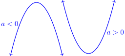
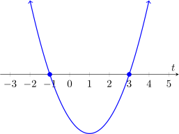

Not all functions are linear, of course. Polynomials are a much larger class of
useful functions.

## Quadratic Functions

---

#### Definition:
A function $f$ is a **quadratic function** if it can be written in the form
$$f(t) = at^2 + bt + c$$
where $a$, $b$, and $c$ may be any constants.

---

When graphed, quadratic functions form **parabolas** like those in the
following picture. If $a > 0$, then the parabola opens upward. If $a\lt0$ then
the parabola opens downward.

#### Examples:

* $f(t) = 3t^2 + 4t - 10$ has $a=3$, $b = 4$, and $c = -10$
* $g(t) = -t^2 + 6$ has $a = -1$, $b = 0$, and $c = 6$.
* $h(t) = (t-2)(t+3) + t$ is also quadratic because the expression can be
    expanded, and like terms can be combined to show that $h(t) = t^2 + 2t - 6$.

### Intercepts

The  $t$-intercepts of a quadratic equation of the form $f(t) = at^2 + bt + c$
are the values of $t$ for which $f(t) = 0$. Equivalently, they are the values
of $t$ at which the graph of $f$ crosses
the horizontal axis, marked with bold dots in
the figure below:

The graph above shows the function $f(t) = t^2 -2t -3$. From the graph, we can
tell that the $t$-intercepts are at  $t=-1$ and $t=3$, but what if we didn't
have a graph? **Here are two ways of finding horizontal axis intercepts:**
Either way we choose, we are trying to solve the equation $f(t) = 0$ for $t$.

* First, you may notice that we can factor the equation for $f(t)$ and rewrite
    it $f(t) = (t+1)(t-3)$. If this is zero, then either $t+1=0$ or $t-3 = 0$.
    Solving both equations for $t$, we see that $t=-1$ or $t=3$, so these are
    both $t$-intercepts of $f$.
* Sometimes it's not easy to factor a quadratic like that, so we use the
    **quadratic formula**, which always gives the **roots**, or horizontal axis
    intercepts, of a quadratic, if they exist. If $f(t) = at^2 + bt + c = 0$ for a quadratic
    function $f$, then the quadratic formula tells us that
    $$ t = \frac{-b \pm \sqrt{b^2 - 4ac}}{2a}$$

    In our case, $a=1$, $b=-2$, and $c=-3$, so substituting these into the
    quadratic formula we have
    $$ t = \frac{2 \pm \sqrt{(-2)^2 - 4(1)(-3)}}{2(1)} = \frac{2 \pm \sqrt{4+12}}{2} = 1 \pm\frac{4}{2}$$

    so $t=-1$ and $t=3$.

    **It is possible for a quadratic equation to have no horizontal axis
    intercepts**. When this happens, the number under the square root in the
    quadratic formula will be negative. Since the square root of a negative
    isn't defined, this means there are no intercepts.

### Maxima and Minima

---

#### Theorem:

A quadratic equation $f(t) = at^2 + bt + c$ has an **extremum**, which just means a maximum or minimum
value, at $t=\frac{-b}{2a}$. The maximum or minimum value of $f$ is then given
by

$$f\left (\frac{-b}{2a}\right)$$

We can tell this is a maximum by determining if the graph opens up or down,
which is determined by whether $a$ is negative or positive:

So, if $a \gt 0$, then the function has a minimum value, and if $a\lt 0$, then
the function has a maximum value.

---

For example, using the function defined above, $f(t) = t^2 - 2t - 3$, we know
that $f$ reaches its minimum value when $t = \frac{-(-2)}{2(1)}=1$, and that
that minimum value is $f(1) = 1^2 - 2(1) - 3 = -4$.

### Graphs of Quadratic Functions?

## Other Forms of Quadratic Functions

Sometimes you want to write an equation for a quadratic function, but the
information you're given doesn't make it very easy to write an equation of the
form $f(t) = at^2 + bt + c$. Depending on what information you're given, vertex
form or intercept form may make it easier.

### Vertex Form

Suppose you're given the following information about a quadratic function $f$ :

> $f$ has a maximum value of $12$ when $t=2$, and passes through the point
> $(1,1)$.

There's an easy way to write down an equation for this quadratic function,
using **vertex form**.

---

The **vertex form** for a quadratic is

$$f(t) = a(t-t_{\text{vert}})^2 + Q_{\text{vert}}$$

where the point $(t_{\text{vert}}, Q_{\text{vert}})$ is the vertex (either
minimum or maximum) point on the graph of the quadratic, and $a$ is the same
constant as in the standard form.

---

Going back to our example above, we are given that the vertex (in this case the
minimum point on the graph) is at $(2, 12)$, so $t_{\text{vert}}=2$ and $Q_{\text{vert}} = 12$. We therefore know that the equation for $f$ looks like $f(t) = a(t-2) + 12$.

We still don't know what $a$ is, but we can use the other piece of information
given to find out. We know that the graph of $f$ passes through the point
$(1,1)$, which means that $f(1) = 1 = a(1-2)^2 + 12$. Solving for $a$ gives us
that $a=-11$, and we can now write the equation for the quadratic function $f$,

$$f(t) = -11(t-2)^2 + 12$$

If we want this in standard form, we can just expand and combine like terms:

$$f(t) = -11(t^2 - 4t + 4) + 12 = -11t^2 + 44t -32$$

### Intercept Form

Suppose you're given the following information about a quadratic function $f$:

> $f$ has horizontal axis intercepts when $t=-3$ and when $t=2$, and $f$ passes
> through the point $(1,-1)$.

Again, it's not easy to use either vertex form or the standard form for
a quadratic to write an equation for this quadratic function.

---

The **Intercept Form** for a quadratic equation is

$$ f(t) = a(t-t_1)(t-t_2)$$

where $a$ is the same constant found in the other two forms, and $t_1$ and $t_2$ are the $t$-values of each of the horizontal axis intercepts of $f$.

---

Using the information from the example, we see that $t_1 = -3$, $t_2 = 2$, so
we have the equation $f(t) = a(t+3)(t-2)$. We need only find the value of $a$,
and we can do this by using the additional information that the graph of $f$
passes through the point $(1,-1)$. That is, $f(1) = -1 = a(1+3)(1-2)$. Solving
for $a$, we see that $a = \frac{1}{4}$, and the equation for $f$ is

$$f(t) = \frac{1}{4}(t+3)(t-2) $$

Again, if we want this in standard form, we can expand and combine like terms:

$$f(t) = \frac{1}{4}(t^2 + 3t -2t -6) = \frac{1}{4}t^2 + \frac{1}{4}t - \frac{3}{2}$$

## Higher-Degree Polynomials

Linear and quadratic functions are examples of a larger class of functions
called **polynomials**.

---

#### Definition:

A **monomial** is an expression of the form $at^n$, where $a$ is any constant,
and is called the **coefficient**,
and $n$ is a whole number, called the **degree** of the monomial.

A **polynomial** is a sum of any number of monomials. Monomials in
a polynomial are called **terms**.

The term in a polynomial with the largest degree is called the **leading
term**, its coefficient  is called the **leading coefficient**, and its degree
is the **degree of the polynomial**.

---

#### Examples:

* $f(t) = 2t^2 - 20t - 6.2234t^4 + 65$ is a polynomial.
    * The leading term of $f$ is $-6.2234t^4$ because it is the term with the
        largest exponent on $t$.
    * The degree of $f$ is $4$, because that's the exponent in the leading
        term.
    * The leading coefficient of $f$ is $-6.2234$.
* $g(t) = 3 + t^{400} - 12t^2$ is a polynomial.
    * The leading term is $t^{400}$.
    * The leading coefficient is $1$ 
    * The degree is $400$.
* $h(t) = t + 1$ is a polynomial.
    * The leading term is $t$.
    * The leading coefficient is $1$.
    * The degree is $1$, since $t = t^1$.

#### Non-Examples:

* $f(t) = 2t^2 - 6t^{-1}$ is not a polynomial, because polynomials only have
    whole number powers of $t$, and $-1$ isn't a whole number.
* $g(t) = 3t^7 - 12t^{3.5}$ is not a polynomial, again because one of the terms
    has an exponent on $t$ of $3.5$, which isn't a whole number.
* $h(t) = \frac{3t^2 + 2}{t - 5}$ is not a polynomial, because it's not a sum
    of monomials.

## Long-Term Behavior of Polynomials

---

The **long-term behavior** of a function $f$ is the behavior of the output of
the function as the input to the function gets very large (approaches
infinity).

The long-term behavior of a function can be one of the following:

* The value of the function increases or decreases without bound, in which case
    we say that the function approaches (or 'goes to')  $\infty$ or $-\infty$.
* The value of the function approaches a number, or
* The value of the function doesn't approach any value.

---

For example, the function $f(t) = -3t$ approaches $-\infty$, because if we put
really big numbers in for $t$, the output of $f$ gets really big in the
negative direction.

The function $h(t) = 2t^4$ approaches $\infty$, because if we put in really big
numbers for $t$, the value of the function gets really big, in the positive
direction.

The function $g(t) = 8$ approaches $8$, because no matter how large the number
we put in for $t$, we always have an output of $8$.

---

#### Theorem:

The **long term behavior of a polynomial function** is determined by its leading
coefficient. If the leading coefficient is positive, then the function
approaches $\infty$ as $t$ increases without bound. If the leading coefficient
is negative, then the function approaches $-\infty$ as $t$ increases without
bound.

---

#### Examples:

* The long-term behavior of the function $f(t) = -t^2 + 6 + 3t^4$ is to
    approach $\infty$, since the leading coefficient  $3$ is positive.
* The long-term behavior of the function $g(t) = 12 - t^2 + t$ is to approach
    $-\infty$, since the leading coefficient $-1$ is negative.
