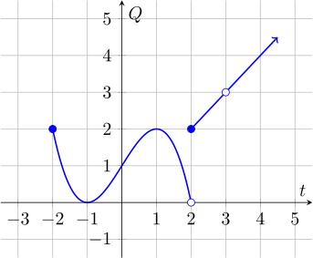

Functions can be combined in many different ways to get new functions. Here are
some of the ways, and how to find the domain of the new function:

The **intersection** of two sets is just the collection of items that are in
both sets. For example, the intersection of the interval  $(-\infty, 0)$ and
the interval $(-4, 10)$ is the set of numbers that are in both intervals, or
$(-4,0)$.

#### Definitions:

* $(f+g)(x)$ means $f(x) + g(x)$
    * The domain of $(f+g)$ is the intersection of the domain of $f$ and the
        domain of $g$.
 
* $(f-g)(x)$ means $f(x) - g(x)$
    * The domain of $(f-g)$ is the intersection of the domain of $f$ and the
        domain of $g$.
* $(f\cdot g)(x)$ means $f(x) \cdot g(x)$
    * The domain of $(f\cdot g)$ is the intersection of the domain of $f$ and the domain of $g$.
* $\left(\frac{f}{g}\right)(x)$ means $\frac{f(x)}{g(x)}$
    * The domain of $\left(\frac{f}{g}\right)$ is the intersection of the domain of $f$ and the domain of $g$, **minus any values of $x$ for which $g(x) = 0$.**

#### Examples
This graph shows the function $f$ :

And $g$ is defined as $g(t) = \frac{1}{t}$.

* The domain of $g + f$, $g - f$, and $g\cdot f$ is just the intersection of
    the domains of $f$ and $g$. Since the domain of $f$ is $[-2, 3)\cup
    (3,\infty)$ and the domain of $g$ is $(-\infty, 0)\cup (0, \infty)$, the
    domain of the sum, difference, and product functions is 
    $$[-2,0)\cup(0,3)\cup (3,\infty)$$
* The domain of $\frac{g}{f}$ is the same as the above functions, except we
    must not include any values of $t$ for which $f(t)$ (the function in the
    denominator) is zero. $f(t) = 0$ when $t=-1$, which is already excluded
    from the intersection of the domains of $f$ and $g$, so the domain of
    $\frac{g}{f}$ is still
    $$[-2,0)\cup(0,3)\cup (3,\infty)$$
* Some examples of evaluating these functions:
    * $(f+g)(1) = f(1) + g(1) = 2 + \frac{1}{1} = 3$ 
    * $(f-g)(-1) = f(-1) - g(-1) = 0 - \frac{1}{-1} = 1$ 
    * $(f\cdot g)(0)=f(0)\cdot g(0)$ is undefined because $g(0)$ is undefined.
    *  $\frac{f}{g}(-2) = \frac{f(-2)}{g(-2)}=\frac{2}{1/(-2)} = 2 \cdot
        \frac{-2}{1} = -4$.

## Composition of Functions

There's another way we can combine functions, called **composition**.

---

#### Definition:
Given two functions $f$ and $g$, the **composition** of $f$ with $g$, which is
written $(f\circ g)(t)$ is defined to be $f\left(g(t)\right)$. We can read this
as "$f$ after $g$".

The domain of the composition $f\circ g$ is the domain of $g$, minus any points
mk

---

We once described functions as machines that take in an input and spit out an
output. So function composition is like feeding a value $t$ to one function,
then feeding the **result** into the next function:

#### Examples:

This graph shows the function $f$ :

And $g$ is defined as $g(t) = \frac{1}{t}$.

* The composition $g\circ f$ has the domain of $f$, minus any values of $t$ 
    such that $f(t)$ is not in the domain of $g$. The domain of $f$ is $[-2,3)\cup(3,\infty)$. The only number not in the
    domain of $g$ is $0$, so we need to avoid any values of $t$ for which $f(t)
    = 0$. This only happens when $t=-1$, so the domain of $g\circ f$ is just
    $[-2,-1)\cup(-1, 3)\cup(3, \infty)$. 
* $(g\circ f)(1) = g(f(1)) = g(2) = \frac{1}{2}$.
*  $(f\circ g)(1) = f(g(1)) = f\left(\frac{1}{1}\right) = 2$.
* $(f\circ f\circ g)(1) = f(f(g(1))) = f(f(1)) = f(2) = 2$.
* $(f\circ f)(-1) = f(f(-1)) = f(0) = 2$.
