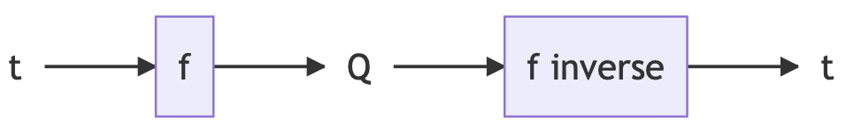
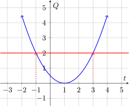
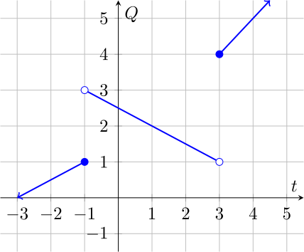

We've talked a lot about all kinds of functions. Recall the analogy that
a function is like a machine, which takes an input and spits out an output. An
**inverse function** is just like a machine that undoes what another machine
does.

---

#### Definition:
Given a function $f$, if $Q = f(t)$ for some $t$, then the **inverse function**
of $f$, given the input $Q$, outputs $t$. We call the inverse function
$f^{-1}$, so we can write $f^{-1}(Q) = t$.

Note that $(f^{-1}\circ f)(t) = t$ and $(f\circ f^{-1})(Q) = Q$.

Note also that the  mathematical domain of  $f^{-1}$ is the image of $f$, and
the  mathematical domain of  $f$ is the image of $f^{-1}$.

---

In a diagram, you can think of the inverse function like this:

### How to tell if a function has an inverse:

Not all functions have inverses. To understand why, remember that a function
must have exactly one output for each input. However, there's nothing wrong
with a function $f$ having two inputs that give the same output.

Suppose $f(t_1) = Q$ and $f(t_2) = Q$ also, with $t_1,t_2$ two different
inputs. Then $f^{-1}(Q) = t_1$ since $f(t_1) = Q$, but we also know that since
$f(t_2) = Q$, it also must be true that  $f^{-1}(Q) = t_2$. These are two
different ouputs for the same input into $f^{-1}$, so $f^{-1}$ isn't a function
and we say that it doesn't exist, or that $f$ does not have an inverse, or is
**not invertible**.

---

#### Theorem

A function $f$ has an inverse, or **is invertible** when it is **one-to-one**,
which means that for each value $Q$ in the image of $f$, there is only one
value of $t$ in the domain of $f$ so that $f(t) = Q$.

---

For example, the following graph shows a function $f$ (in blue) which is not one-to-one
because there are multiple values of $t$ for which $f(t) = 2$.

We can see that $f$ is not one-to-one by placing a horizontal line over the
graph, and sliding it up and down. If at any height, the line crosses the graph
of $f$ more than once, then $f$ is not one-to-one, and $f$ is not invertible.

### Finding Inverses

You may be asked to find values of inverse functions, or to find a formula for
an inverse function given a formula for the original function.

#### From a table:

$t$ | $f(t)$
-|-
-1 | 3
0 | 2
1 | 4
2 | 6
3 | 8
4 | 7

The table above gives outputs of $f$ for different values of $t$. We can use it
to find the value of $f^{-1}$ for certain inputs.

Notice that no two values of $t$ in the table result in the same output from $f$, so $f$ is one-to-one, and $f^{-1}$ exists.
For example, since $f(-1) = 3$, $f^{-1}(3) = -1$.

Use the same reasoning to compute the value of:

* $f^{-1}(2)$
* $f^{-1}(7)$
* $f^{-1}(8)$
* $f^{-1}(4)$

#### From a Graph:

If the graph above shows a function $f$, first let's determine if $f$ is
one-to-one. We can do this using the trick above, where we slide a horizontal
line up and down across the graph, and see if the graph ever intersects the
graph more than once. In this case it would not, so $f$ is one-to-one, and an
inverse exists.

(You might think that when you put the line at height 1 it crosses the graph
twice, but remember that the open dot at the end of a line means that the line
doesn't extend all the way to the location of the dot.).

Using the graph, we can see for example that  $f(1) = 2$, so we know that
$f^{-1}(2) = 1$. We could also read the value of $f^{-1}(2)$ directly from the
graph, by finding the place on the graph which has height (output of $f$) equal
to $2$, and then reading the $t$-value for that point on the graph.

Using the same reasoning, find the values of:

* $f^{-1}(1)$
* $f^{-1}(4)$
* $f^{-1}(5)$
* $f^{-1}(3.5)$ (This is a trick! $f^{-1}(3.5)$ does not exist, because there
    is no value of $t$ for which $f(t) = 3.5$)
* $f^{-1}(3)$ (This is similar to the last one! See if you can explain why)

#### From a Formula:

Often, you will be given a formula for $f$ and be asked to find a formula for
$f^{-1}$. You should do this by chosing a variable name for the output of $f$,
like  $Q$, and then by solving $Q=f(t)$ for $t$. The result is a formula for
$f^{-1}$ in terms of $Q$.

For example, suppose you are given $f(t) = \frac{1}{3 - t}$. To find an
equation for $f^{-1}$, we need to solve $Q = \frac{1}{3-t}$ for $t$, using the
following steps:

$$
\begin{alignedat}{2}
Q =& \frac{1}{3-t} \ \ \ \ \ \ \ \ \ & \text{multiply both sides by } (3-t) \\\\[10pt]
Q(3-t)=& 1 & \text{divide both sides by } Q \\\\[10pt]
3-t=& \frac{1}{Q} & \text{subtract 3 from both sides}\\\\[10pt]
-t=& \frac{1}{Q} - 3 & \text{multiply both sides by } -1 \\\\[10pt]
f^{-1}(Q)=t=& -\frac{1}{Q} + 3 & \\\\[10pt]
\end{alignedat}
$$

We can now use this formula for $f^{-1}$ to compute the value of the inverse
function of $f$ for any input that we want.

Try using the same technique to find formulas for the inverses of:

*  $h(t) = 2t - 4$
*  $g(t) = e^{3t + 1}$
* $r(t) = \frac{4}{2t-1}$
